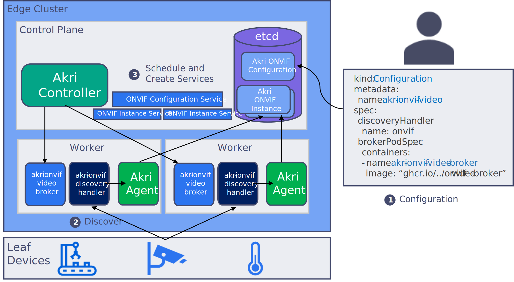

# ONVIF for IP Cameras

## Background

ONVIF is a standard used by many IP cameras and defines discovery and access for RTSP camera streams. Along with an ONVIF Discovery Handler, Akri has provided a generic ONVIF Configuration for initiating ONVIF discovery. Akri has also provided a sample broker (`akri-onvif-video-broker`), which acts as a frame server.

Using Akri's default ONVIF Configuration to discover and utilize ONVIF cameras looks like the following:



1. An operator applies the ONVIF Configuration to the cluster (by enabling ONVIF when installing the Akri Helm chart). They also specific a broker image -- `akri-onvif-video-broker` in the figure.
2. The Akri Agent uses the ONVIF Discovery Handler to discover the IP cameras and creates Instances for each discovered camera.
3. The Akri Controller sees the Instances and deploys `akri-onvif-video-broker` pods, which were specified in the Configuration. The Controller also creates a Kubernetes service for each ONVIF camera along with one service for all the ONVIF cameras.

All of Akri's components can be deployed by specifying values in its Helm chart during an installation. This section will cover the values that should be set to (1) deploy the ONVIF Discovery Handlers and (2) apply a Configuration that tells Akri to discover devices using that Discovery Handler.

## Deploying the ONVIF Discovery Handler

In order for the Agent to know how to discover IP cameras an ONVIF Discovery Handler must exist. Akri supports an Agent image that includes all supported Discovery Handlers. This Agent will be used if `agent.full=true`. By default, a slim Agent without any embedded Discovery Handlers is deployed and the required Discovery Handlers can be deployed as DaemonSets. This documentation will use that strategy, deploying ONVIF Discovery Handlers by specifying `onvif.discovery.enabled=true` when installing Akri.

## ONVIF Configuration Settings

Instead of having to assemble your own ONVIF Configuration yaml, we have provided a [Helm template](https://github.com/project-akri/akri/blob/main/deployment/helm/templates/onvif-configuration.yaml). Helm allows us to parametrize the commonly modified fields in our configuration files, and we have provided many for ONVIF (to see them, run `helm inspect values akri-helm-charts/akri`). More information about the Akri Helm charts can be found in the [user guide](../user-guide/getting-started.md#understanding-akri-helm-charts). To apply the ONVIF Configuration to your cluster, simply set `onvif.configuration.enabled=true` along with any of the following additional Configuration settings when installing Akri.

### Discovery Handler Discovery Details Settings

Discovery Handlers are passed discovery details that are set in a Configuration to determine what to discover, filter out of discovery, and so on. The ONVIF Discovery Handler, supports the following discovery details:

| Helm Key | Value | Default | Description |
| :--- | :--- | :--- | :--- |
| onvif.configuration.discoveryDetails.ipAddresses.action | Include, Exclude | Exclude | filter action to take on a set of IP addresses |
| onvif.configuration.discoveryDetails.ipAddresses.items | array of IP addresses | empty | IP addresses that the filter action acts upon |
| onvif.configuration.discoveryDetails.macAddresses.action | Include, Exclude | Exclude | filter action to take on a set of mac addresses |
| onvif.configuration.discoveryDetails.macAddresses.items | array of mac addresses | empty | mac addresses that the filter action acts upon |
| onvif.configuration.discoveryDetails.scope.action | Include, Exclude | Exclude | filter action to take on a set of scopes |
| onvif.configuration.discoveryDetails.scope.items | array of scopes | empty | scopes that the filter action acts upon |
| onvif.configuration.discoveryDetails.uuids.action* | Include, Exclude | Exclude | filter action to take on a set of device uuids |
| onvif.configuration.discoveryDetails.uuids.items* | array of IP addresses | empty | device uuids that the filter action acts upon |
| onvif.configuration.discoveryDetails.discoveryTimeoutSeconds | number of seconds | 1 | max amount of time the Discovery Handler should search before reporting any (newly) discovered devices |

*Onvif device uuid: the address property of the Endpoint Reference [ONVIF Core Specification 7.3.1 Endpoint reference] can be used as the device id to identify the device.
The address property in Endpoint Reference is in the Uniform Resource Name: Universally Unique Identifier (URN:UUID) format.
The same UUID can be retrieved by the `GetEndpointReference` command after a camera is discovered by Probe message.

### Broker Pod Settings

If you would like non-terminating workloads ("broker" Pods) to be deployed automatically to discovered cameras, a broker image should be specified (under `brokerPod`) in the Configuration. Alternatively, if it meets your scenario, you could use the Akri frame server broker ("ghcr.io/project-akri/akri/onvif-video-broker"). If you would rather manually deploy pods to utilize the cameras advertized by Akri, don't specify a broker pod and see our documentation on [requesting resources advertized by Akri](../user-guide/requesting-akri-resources.md).

> Note only a `brokerJob` OR `brokerPod` should be specified.

| Helm Key | Value | Default | Description |
| :--- | :--- | :--- | :--- |
| onvif.configuration.brokerPod.image.repository | image string | "" | image of broker Pod that should be deployed to discovered devices |
| onvif.configuration.brokerPod.image.tag | tag string | "latest" | image tag of broker Pod that should be deployed to discovered devices |
| onvif.configuration.brokerPod.resources.memoryRequest | string | "98Mi" | the minimum amount of RAM that must be available to this Pod for it to be scheduled by the Kubernetes Scheduler. Default based on the Akri ONVIF sample broker. Adjust to the size of your broker. |
| onvif.configuration.brokerPod.resources.cpuRequest | string | "134m" | the minimum amount of CPU that must be available to this Pod for it to be scheduled by the Kubernetes Scheduler. Default based on the Akri ONVIF sample broker. Adjust to the size of your broker. |
| onvif.configuration.brokerPod.resources.memoryLimit | string | "400Mi" | the maximum amount of RAM this Pod can consume. Default based on the Akri ONVIF sample broker. Adjust to the size of your broker. |
| onvif.configuration.brokerPod.resources.cpuLimit | string | "2800m" | the maximum amount of CPU this Pod can consume. Default based on the Akri ONVIF sample broker. Adjust to the size of your broker. |

### Broker Job Settings

If you would like terminating [Jobs](https://kubernetes.io/docs/concepts/workloads/controllers/job/) to be deployed automatically to discovered cameras, a broker image should be specified (under `brokerJob`) in the Configuration. A Kubernetes Job deploys a set number of terminating Pods.

> Note only a `brokerJob` OR `brokerPod` should be specified.

| Helm Key | Value | Default | Description |
| :--- | :--- | :--- | :--- |
| onvif.configuration.brokerJob.image.repository | image string | "" | image of broker Job that should be deployed to discovered devices |
| onvif.configuration.brokerJob.image.tag | tag string | "latest" | image tag of broker Job that should be deployed to discovered devices |
| onvif.configuration.brokerJob.resources.memoryRequest | string | "98Mi" | the minimum amount of RAM that must be available to this Pod for it to be scheduled by the Kubernetes Scheduler. Adjust to the size of your broker. |
| onvif.configuration.brokerJob.resources.cpuRequest | string | "134m" | the minimum amount of CPU that must be available to this Pod for it to be scheduled by the Kubernetes Scheduler. Adjust to the size of your broker. |
| onvif.configuration.brokerJob.resources.memoryLimit | string | "400Mi" | the maximum amount of RAM this Pod can consume.Adjust to the size of your broker. |
| onvif.configuration.brokerJob.resources.cpuLimit | string | "2800m" | the maximum amount of CPU this Pod can consume. Adjust to the size of your broker. |
| onvif.configuration.brokerJob.command | string array | Empty | command to be executed in the Pod |
| onvif.configuration.brokerJob.restartPolicy | string array | `OnFailure` | `RestartPolicy` for the Job. Can either be `OnFailure` or `Never` for Jobs.|
| onvif.configuration.brokerJob.backoffLimit | number | 2 | defines the Kubernetes Job [backoff failure policy](https://kubernetes.io/docs/concepts/workloads/controllers/job/#pod-backoff-failure-policy) |
| onvif.configuration.brokerJob.parallelism | number | 1 | defines the Kubernetes Job [`parallelism`](https://kubernetes.io/docs/concepts/workloads/controllers/job/#parallel-jobs) |
| onvif.configuration.brokerJob.completions | number | 1 | defines the Kubernetes Job [`completions`](https://kubernetes.io/docs/concepts/workloads/controllers/job) |

### Disabling Automatic Service Creation

By default, if a broker Pod is specified, the generic ONVIF Configuration will create services for all the brokers of a specific Akri Instance and all the brokers of an Akri Configuration. The creation of these services can be disabled.

| Helm Key | Value | Default | Description |
| :--- | :--- | :--- | :--- |
| onvif.configuration.createInstanceServices | true, false | true | a service should be automatically created for each broker Pod |
| onvif.configuration.createConfigurationService | true, false | true | a single service should be created for all brokers of a Configuration |

### Capacity Setting

By default, if a broker Pod is specified, a single broker Pod is deployed to each device. To modify the Configuration so that a camera is accessed by more or fewer nodes via broker Pods, update the `onvif.configuration.capacity` setting to reflect the correct number. For example, if your high availability needs are met by having 1 redundant pod, you can update the Configuration like this by setting `onvif.configuration.capacity=2`.

| Helm Key | Value | Default | Description |
| :--- | :--- | :--- | :--- |
| onvif.configuration.capacity | number | 1 | maximum number of brokers that can be deployed to utilize a device (up to 1 per Node) |

### Discovery Handler Discovery Properties Settings

Agent read the the content of `discoveryProperties` in Configuration and generate a string key-value pair list to Discovery Handler.  The Onvif discovery handler
leverage the `discoveryProperties` to read the credentials for authenticated discovery. There are two attributes required for Onvif discovery handler to perform
authenticated discovery:
1. an id that can unique identify a camera
2. a credential (username/password) to authenticate the access to a camera

Onvif discovery handler can get the device uuid when discovering Onvif camera devices, and use the id to look up matched credential from the string key-value pair list passed by Agent.

#### Organize Credentials in Akri Configuration and Kubernetes Secrets
All secret information are kept in Kubernetes Secrets. In Configuration, we need to create a mapping for the secret information so Agent
can read the secret information and pass it with the mapping to Onvif Discovery Handler.  With the mapping and secret information, Onvif
Discovery Handler can look up credential using device ids.

There are 3 ways to organize secret information:
1.	Device credential list
2.	Device credential ref list
3.	Device credential entry

All three ways can be used in the same Configuration, the order above is the order of Onvif Discovery Handler processing the secret 
information. If there is any secret information duplication between different groups, the latter overwrites the prior entries.
If there is any duplication within the same group, it’s up to the Onvif Discovery Handler to decide which one wins when processing
the entries, and it’s not guaranteed the order is always the same.

##### Device credential list
Onvif Discovery Handler first looks for a key named “`device_credential_list`” and expects its value points to a string array of credential
lists in json format.  The value is an array of credential list which points to a Kubernetes secret, the secret is expected in json format.

Here is an example of Device credential list.
In Configuration, an entry named “`device_credential_list`” is listed in discoveryProperties.  The value contains an array of device secret lists.  The device secret lists are entries that point to the actual Kubernetes Secret key.

```yaml
    discoveryProperties:
    - name: "device_credential_list"
      value: |+
        [
          "secret_list1",
          "secret_list2"
        ]
    - name: "secret_list1"
      valueFrom:
        secretKeyRef:
          name: "onvif-auth-secret"
          namespace: "onvif-auth-secret-namespace"
          key: "secret_list1"
          optional: false
    - name: "secret_list2"
      valueFrom:
        secretKeyRef:
          name: "onvif-auth-secret"
          namespace: "onvif-auth-secret-namespace"
          key: "secret_list2"
          optional: false
```

In Kubernetes Secret `onvif-auth-secret`, the `secret_list1` and `secret_list2` contain the actual secret information for a list of devices.  The entry uses the device id as key and the value is a json object with username and password.  The password can be optionally encoded with base64 (with “`base64encoded`” set to true).

```yaml
apiVersion: v1
kind: Secret
metadata:
  name: onvif-auth-secret
  namespace: onvif-auth-secret-namespace
type: Opaque
stringData:
  secret_list1: |+
    {
      "6821dc67-8438-5588-1547-4d1349048438" : { "username" : "admin", "password" : "adminpassword" },
      "6a67158b-42b1-400b-8afe-1bec9a5d7919" : { "username" : "user1", "password" : "SGFwcHlEYXk=", "base64encoded": true }
    }
  secret_list2: |+
    {
      "5f5a69c2-e0ae-504f-829b-00fcdab169cc" : { "username" : "admin", "password" : "admin" }
    }
```

##### Device credential ref list

Device credential ref list is similar to Device credential list except the device ids are listed and the credentials are references 
to another entries in the Akri `discoveryProperties`. The key name for device credential ref list is “`device_credential_ref_list`”.

For example, the device credential ref list below contains an array of “device id”->”credential reference” objects.  The credential of device id “5f5a69c2-e0ae-504f-829b-00fcdab169cc” is refered to (username-> device1_username, password->device1_password).  The device1_username and device1_password are entries in Akri discoverProperties that point to the actual secret information in Kubernetes Secrets.  Note different device ids may use the same secret reference.

```yaml
    - name: "device_credential_ref_list"
      value: |+
        [
          "secret_ref_list1",
          "secret_ref_list2"
        ]
    - name: "secret_ref_list1"
      value: |+
        {
          "5f5a69c2-e0ae-504f-829b-00fcdab169cc" : { "username_ref" : "device1_username", "password_ref" : "device1_password" },
          "6a67158b-42b1-400b-8afe-1bec9a5d7909":  { "username_ref" : "device2_username", "password_ref" : "device2_password" }
        }
    - name: "secret_ref_list2"
      value: |+
        {
          "7a67158b-42b1-400b-8afe-1bec9a5d790a":  { "username_ref" : "device2_username", "password_ref" : "device2_password" }
        }
    - name: "device1_username"
      valueFrom:
        secretKeyRef:
          name: "onvif-auth-secret"
          namespace: "onvif-auth-secret-namespace"
          key: "device1_username"
          optional: false
    - name: "device1_password"
      valueFrom:
        secretKeyRef:
          name: "onvif-auth-secret"
          namespace: "onvif-auth-secret-namespace"
          key: "device1_password"
          optional: true
    - name: "device2_username"
      valueFrom:
        secretKeyRef:
          name: "onvif-auth-secret"
          namespace: "onvif-auth-secret-namespace"
          key: "device2_username"
          optional: false
    - name: "device2_password"
      valueFrom:
        secretKeyRef:
          name: "onvif-auth-secret"
          namespace: "onvif-auth-secret-namespace"
          key: "device2_password"
          optional: true
```

The actual secret information is in Kubernetes Secret `onvif-auth-secret`

```yaml
apiVersion: v1
kind: Secret
metadata:
  name: onvif-auth-secret
  namespace: onvif-auth-secret-namespace
type: Opaque
stringData:
  device1_username: "admin"
  device1_password: "admin"
  device2_username: "cam2_user"
  device2_password: "cam2_pwd"
```

##### Device credential entry
Device credential entry is a direct mapping from device id to its credential, using "`username_<device-id>`" and "`password_<device id>`" 
as key names, note that `device_id` is in uuid string format, need to convert to C_IDENTIFIER format for use it 
in `discoveryProperties` key name.

In addition to the "`username_<device-id>`" and "`password_<device-id>`" keys, Onvif Discovery Handler looks for two specific key names
"`username_default`" and "`password_default`" that, if specified, Onvif Discovery Handler uses it as a fall back username/password value.
If Onvif Discovery Handler cannot find a match credential by looking up the device id, and "`username_default`"/"`password_default`" are specified,
Onvif Discovery Handler uses the default username/password to authenticate the device discovery.

```yaml
    discoveryProperties:
    - name: "username_6a67158b_42b1_400b_8afe_1bec9a5d7909"
      valueFrom:
        secretKeyRef:
          name: "onvif-auth-secret"
          namespace: "onvif-auth-secret-namespace"
          key: "username_6a67158b_42b1_400b_8afe_1bec9a5d7909"
          optional: false
    - name: "password_6a67158b_42b1_400b_8afe_1bec9a5d7909"
      valueFrom:
        secretKeyRef:
          name: "onvif-auth-secret"
          namespace: "onvif-auth-secret-namespace"
          key: "password_6a67158b_42b1_400b_8afe_1bec9a5d7909"
          optional: false
```

The actual secret information is in Kubernetes Secret `onvif-auth-secret`
```yaml
apiVersion: v1
kind: Secret
metadata:
  name: onvif-auth-secret
  namespace: onvif-auth-secret-namespace
type: Opaque
stringData:
  username_6a67158b_42b1_400b_8afe_1bec9a5d7909: "admin"
  password_6a67158b_42b1_400b_8afe_1bec9a5d7909: "admin"
```

### Installing Akri with the ONVIF Configuration and Discovery Handler

Leveraging the above settings, Akri can be installed with the ONVIF Discovery Handler and an ONVIF Configuration that specifies the Akri frame server broker:

> Note: See [the cluster setup steps](../user-guide/cluster-setup.md#configure-crictl) for information on how to set the crictl configuration variable `AKRI_HELM_CRICTL_CONFIGURATION`

```bash
helm repo add akri-helm-charts https://project-akri.github.io/akri/
helm install akri akri-helm-charts/akri \
    $AKRI_HELM_CRICTL_CONFIGURATION \
    --set onvif.discovery.enabled=true \
    --set onvif.configuration.enabled=true \
    --set onvif.configuration.brokerPod.image.repository="ghcr.io/project-akri/akri/onvif-video-broker" \
    --set onvif.configuration.brokerPod.image.tag="latest"
```

No discovery details were provided to filter the Discovery Handler's search so the Discovery Handler will find any ONVIF camera on the network and will deploy up to one broker pod to each camera, since `capacity` defaults to one. The brokers will supply the automatically created Instance Services and the Configuration Service with frames.

The following installation examples have been given to show how to the ONVIF Configuration can be tailored to you cluster:

* Filtering ONVIF cameras
* Changing the discovery timeout

#### Filtering ONVIF cameras

The ONVIF Discovery Handler supports basic filter capabilities has been provided. Discovery details can be set in the Configuration that tell the Discovery Handler to either include or exclude specific IP addresses, MAC addresses, ONVIF scopes, or device uuids.

For example, the following enables discovery of every camera that does not have an IP address of 10.0.0.1:

```bash
helm repo add akri-helm-charts https://project-akri.github.io/akri/
helm install akri akri-helm-charts/akri \
    $AKRI_HELM_CRICTL_CONFIGURATION \
    --set onvif.discovery.enabled=true \
    --set onvif.configuration.enabled=true \
    --set onvif.configuration.brokerPod.image.repository="ghcr.io/project-akri/akri/onvif-video-broker" \
    --set onvif.configuration.discoveryDetails.ipAddresses.action=Exclude \
    --set onvif.configuration.discoveryDetails.ipAddresses.items[0]=10.0.0.1
```

The following enables discovery of every camera that uuid is not `3fa1fe68-b915-4053-a3e1-ac15a21f5f91`:

```bash
helm repo add akri-helm-charts https://project-akri.github.io/akri/
helm install akri akri-helm-charts/akri \
    $AKRI_HELM_CRICTL_CONFIGURATION \
    --set onvif.discovery.enabled=true \
    --set onvif.configuration.enabled=true \
    --set onvif.configuration.brokerPod.image.repository="ghcr.io/project-akri/akri/onvif-video-broker" \
    --set onvif.configuration.discoveryDetails.uuids.action=Exclude \
    --set onvif.configuration.discoveryDetails.uuids.items[0]="3fa1fe68-b915-4053-a3e1-ac15a21f5f91"
```

You can enable cluster access for every camera with a specific name, you can modify the Configuration like so:

```bash
helm repo add akri-helm-charts https://project-akri.github.io/akri/
helm install akri akri-helm-charts/akri \
    $AKRI_HELM_CRICTL_CONFIGURATION \
    --set onvif.discovery.enabled=true \
    --set onvif.configuration.enabled=true \
    --set onvif.configuration.brokerPod.image.repository="ghcr.io/project-akri/akri/onvif-video-broker" \
    --set onvif.configuration.discoveryDetails.scopes.action=Include \
    --set onvif.configuration.discoveryDetails.scopes.items[0]="onvif://www.onvif.configuration.org/name/GreatONVIFCamera" \
    --set onvif.configuration.discoveryDetails.scopes.items[1]="onvif://www.onvif.configuration.org/name/AwesomeONVIFCamera"
```

#### Changing the discovery timeout

The ONVIF Discovery Handler will search for up to `discoveryTimeoutSeconds` for IP cameras. This timeout can be increased or decreased as desired, and defaults to 1 second if not configured. It can be set in the Configuration like this:

```bash
helm repo add akri-helm-charts https://project-akri.github.io/akri/
helm install akri akri-helm-charts/akri \
    $AKRI_HELM_CRICTL_CONFIGURATION \
    --set onvif.discovery.enabled=true \
    --set onvif.configuration.enabled=true \
    --set onvif.configuration.brokerPod.image.repository="ghcr.io/project-akri/akri/onvif-video-broker" \
    --set onvif.configuration.discoveryDetails.discoveryTimeoutSeconds=2
```

## Modifying a Configuration

Akri has provided further documentation on [modifying the broker PodSpec](../user-guide/customizing-an-akri-installation.md#modifying-the-brokerpodspec), [instanceServiceSpec, or configurationServiceSpec](../user-guide/customizing-an-akri-installation.md#modifying-instanceservicespec-or-configurationservicespec) More information about how to modify an installed Configuration, add additional Configurations to a cluster, or delete a Configuration can be found in the [Customizing an Akri Installation document](../user-guide/customizing-an-akri-installation.md).

## Implementation details

The ONVIF implementation can be understood by looking at several things:

1. [OnvifDiscoveryDetails](https://github.com/project-akri/akri/blob/main/discovery-handlers/onvif/src/discovery_handler.rs) defines the required properties
2. [OnvifDiscoveryHandler](https://github.com/project-akri/akri/blob/main/discovery-handlers/onvif/src/discovery_handler.rs) defines ONVIF camera discovery
3. [samples/brokers/onvif-video-broker](https://github.com/project-akri/akri/tree/main/samples/brokers/onvif-video-broker) defines the ONVIF broker

