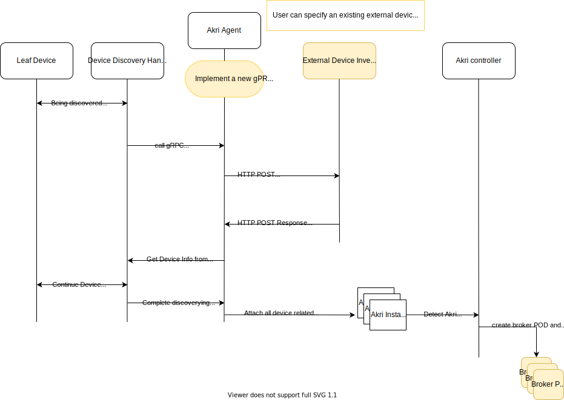

# Integrate with external device inventory

## Background
Akri extracts device information (onvif,opcua or udev device) only from discovery procedure. 

For example, Akri discovers onvif camera and extracts information such as video stream source URI through ONVIF discovery and ONVIF command. Video source URI is then used in broker POD to build connection with the camera.

But there are other important device information that can not be extracted through discovery procedure itself. It limits Akri being used in real world production environment.

1.  If ONVIF devices are protected by credential, Akri agent won't be able to find out video stream source URI because the ONVIF command need pass authentication. If RTSP stream is also protected with its own credential, broker POD will not be able to receive video stream. Same problem happens when OPC UA servers (such as facotry PLCs) only serve those OPCUA clients having approved X509 cert and related private key. Broker pod is unable to build a OPC UA connection since Akri does not have PLCs's authentication information.

2. Not only credential, there maybe also important device meta data information that is essential for business logic implementation in broker POD, such as the PLC machine's serial number or asset hierachy information.

3. Real world projects may ask for a proper device provisioning enrollment procedure. Before a device is enrolled, even it is discovered, broker POD should not be created and started. Akri acts on discovery automatically now without considering device provisioning.  

The above issues can be resolved by allowing Akri getting additional device infomration from an external optional device inventory system. This proposal will introduce a few additional steps in Akri's workflow to allow Akri extracting addtioanl device information from external source. 

## Proposal

The below workflow presents a new flow from discovering device till creating broker POD. Additional steps are highlighted as yellow color.

- Introduce a new setting that user can specify the name of a customized external device inventory POD or service, so Akri agent can request for additional device information. The proposed external device inventory POD/service must expose a REST POST API /queryDevice for Akri Agent to raise request.
- Instead of directly creating Akri instance after Akri agent discovers new devices, Akri agent will query the external device inventory POD/service to get more device related information, including credential. 
- Please note for protected ONVIF device, Akri agent should use the ONVIF credential to finish a successful discovery work, such as querying stream URI.

This proposed external device inventory POD/service name should be set within each Akri configuration, so it is possible that different discovery config has specified external device inventory system. Another flag is proposed to define if the related external device inventory sytem is also device provisioning database. If it is provisioning database, when Akri agent can not fetch any record of a discovered device, it wont create Akri instance for this device. There wont be broker POD created neither for that device. 

The external device inventory POD is not deployed by Akri but solution developer will take care. One possible implementation of the device inventory POD can be a POD with a mounted Azure Key Vault drive using AKV ARC extenstion. It can fetch device credential and assist Akri agent. The benefit is that device credential can be centrally managed from cloud.   

## Additional Usage 1: what if a device is undiscoverable but can be added manually
With this new proposed connection between Akri Agent and external device inventory system, Akri can achieve one more new feature. Akri can create broker POD for an undiscoverable device, such case like a camera does not support ONVIF discovery but we know its RTSP stream URI.
To achieve this, Akri Agent may provide a HTTP POST REST API with URI /addDevice. External inventory system may trigger a manual device adding procedure with all necessary device infomation. After receiving "/addDevice" request, Akri agent can still create a Akrii and in the end a broker POD is created to process this manually added device.

## Additional Usage 2: what if a device's credential is changed
Akri agent may provide another HTTP POST REST API with URI /updateDevice. External inventory system may update Akri agent that device information is changed. Akri agent may recreate or update a Akri instance. Akri controller will detect the customer resource change and schdule new broker POD.