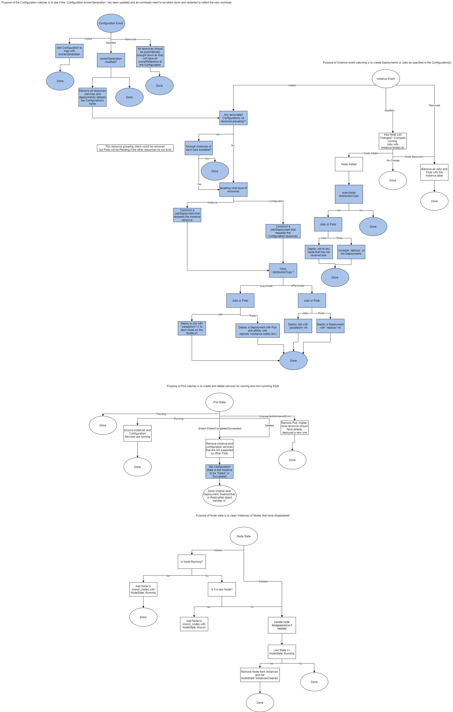

# Infrastructure for Multiple Deployment Strategies
Akri simplifies the discovery and use of devices. This proposal is focused on expanding the use
scenarios Akri can support. In this document, the term "deployment strategy" is used to describe the
number of Pods the Akri Controller deploys to discovered devices. Currently, the Akri Controller has
one deployment strategy. It deploys a Pod (that Akri calls a "broker") to each Node that can see a
device. It enables every node that can see a device to use it (can be limited by `capacity`), and it
expects these Pods to never terminate. This strategy can support scenarios such as creating Protocol
translation gateways (ie a broker advertises a USB camera as an IP camera) and device data brokering
(ie a broker continually grabs the temperature from a thermometer). However, there are many
scenarios it does not support, such as device management scenarios where a short lived broker should
be deployed, deploying a broker to use multiple devices (say 2 IP cameras and a GPU), deploying a
certain number of brokers (say 3 brokers for the cluster), and more. 

This document discusses how to add support for multiple deployment strategies in Akri. It ultimately
proposes a phased approach with 5 phases of building up the Configuration CRD, Instance CRD, Agent,
and Controller to support several strategies. It assumes the support of terminating Pods via Jobs as
explained in [this proposal](https://github.com/project-akri/akri-docs/pull/17).

[This is the original
proposal](https://github.com/project-akri/akri-docs/blob/main/proposals/broker-deployment-strategies.md)
that introduced the discussion of deployment strategies.

| | |
| --- | --- |
| Proposal Date | 11/29/2021 |
| Author | Kate Goldenring |

## Terms
| Term | Definition |
| --- | --- |
| `capacity`  | Maximum amount of containers that can use a device. Defines the number of usage slots a device's device plugin advertises to the kubelet |
| Instance-level resources | Creating a device plugin and therefore Kubernetes resource for each Instance (or device). |
| Configuration-level resources | Advertising devices of the same Configuration under one device plugin, making one requestable resource. |
| broker | The word Akri uses to describe the workload (currently only Pods) that the Akri Controller automatically deploys to use discovered IoT devices |
| Pod | The smallest deployable unit in Kubernetes |
| Jobs  | a [Job](https://kubernetes.io/docs/concepts/workloads/controllers/job/) is a higher level Kubernetes object that creates one or more (by increasing `parallelism` value) identical Pods and will retry until a set number of them successfully terminate. |
| Configuration-level (CL) resource | An extended resource that comes from the creation by the Agent of a Kubernetes device plugin for a Configuration. It enables requesting any of a set of (Configuration) resources, such as any IP camera, thermometer, etc. Resources are given the Configuration name. A request to use a CL resource is mapped to an IL resource by the Agent. |
| Instance-level (IL) resource | An extended resource that comes from the creation by the Agent of a Kubernetes device plugin for a specific Instance, such as a specific IP camera, thermometer, etc. Resources are named in the format <Configuration Name>-<HASH>, where the input to the one-way hash is a descriptor of the Instance (and node name for local non-shared devices). each Configuration |

## Background
Currently, Akri has only one deployment strategy: for each discovered device, a broker Pod is
deployed to each node on the associated Instance's `nodes` list, resembling scenario `1A` in the
scenarios table. If the device is no longer visible (i.e. goes offline), then the Instance is
deleted by the Agent and the broker is brought down by the Controller. If the device reappears, the
broker is re-scheduled. A user can specify how many nodes can utilize a single device by setting the
`capacity` value in a Configuration. A value of two means at most two broker Pods will utilize the
device at once. The broker is not allowed to ever terminate. 

This is a fairly specific scenario. This document proposes how the Controller, Agent, Configuration
CRD, and Instance CRD can be redesigned to support multiple deployment strategies. Namely, it aims
to support ones from the [strategy matrix](#Pod-Deployment-Strategy-Matrix) that have the most real
life use cases and to add support in a way that more strategies can be enabled in the future.

## Supporting More Deployment Strategies
All deployment strategies can be broken down to the question: how many brokers should run on how
many nodes using which resources/instances? In these terms, Akri's existing deployment strategy is 1
broker per Node using one specific Instance. Currently, that broker can only be a non-terminating
Pod.

Akri should support more deployment strategies and deploying not only non-terminating Pods but also
Jobs. A proposal for adding support for deploying Jobs can be found in [PR
here](https://github.com/project-akri/akri-docs/pull/17).

### Example Scenarios to Support
The following is a list of some of the scenarios Akri currently can support:
- Protocol translation gateways
- Message brokers
- Publishing data from devices
- Video streaming

When support for Jobs is added, Akri will be able to support scenarios with short-lived Pods, such
as:
- Device management (modifying the settings of a device)
- Firmware updates (ie performing an upgrade on an IP camera)
- Performing an action (such as taking a picture, reading the temperature, etc)
- Device inventory (adding a device to a catalog after discovery by Akri), and more. 

The following are some scenarios that Akri cannot currently support that this document will provide
a path to support:
- A broker is using more than one device of a Configuration
- A broker is using devices of multiple Configuration
- Only a certain number of brokers are deployed (rather than to every Node that can see it)
- Multiple identical brokers are deployed to the same node (for high availability)
- Users can request any number of resources of a certain type (Configuration) rather than having to
  request a specific device (Instance)

### Non-Terminating Pod Brokers
A Pod is the smallest deployable unit in Kubernetes. Pods are often managed by higher level
resources in Kubernetes, such as a
[DaemonSet](https://kubernetes.io/docs/concepts/workloads/controllers/daemonset/) or
[Deployment](https://kubernetes.io/docs/concepts/workloads/controllers/deployment/). The Kubernetes
Scheduler will place Pods on Nodes with the appropriate available resources and abide by the Pod
affinity and Node affinity rules of the DaemonSet or Deployment. These Pods are never allowed to
terminate as Deployments and DaemonSets require a `RestartPolicy` of `Always`.

> Note: "Deployment" is an overloaded word. Whenever the capitalized term "Deployment" is used, it
is referring to the creation and use of [Kubernetes
Deployment](https://kubernetes.io/docs/concepts/workloads/controllers/deployment/) objects.

Currently, instead of DaemonSets and Deployments, the Controller takes a hands-on approach,
deploying a Pod to each Node. In a way, the Controller is replicating the work of the Kubernetes
DaemonSet or Deployment (with Pod anti-affinity) scheduler. This document proposes **leveraging
Kubernetes Deployment objects in order to slim down the Controller and use concepts familiar with
Kubernetes users**. For scenarios with non-terminating Pods, this document proposes creating
Kubernetes Deployments on behalf of the user to achieve all scenarios. Scenarios will be targeted by
setting Pod anti-affinity and Node affinity. This allows scheduling work to be offloaded to the
Kubernetes Scheduler.

The following Strategy Matrix displays all permutations of possible decisions on how many broker
Pods to deploy, on which Nodes, using what resources. The first line of each entry starts with an
entry index (such as `2B`) and then a description of the scenario. The next line contains the type
of `Deployment` that the Controller can create to fulfil the scenario, and the final line defines
the purpose of the strategy. Note that all strategies can be achieved via `Deployments` by adding
Pod anti-affinity and Node affinity.

The columns of the matrix describe how many of a certain type of device should be targeted. For
example, should a broker target one IP camera or D IP cameras? Currently the Controller can do the
former but not the latter. When trying to target d of D IP cameras, what if each of the Nodes can
see a different set of the cameras? Then, if a Deployment is created targeting d devices, brokers
will only be executed on the Nodes that can see those specific d Instances. This brings up the need
to support Configuration-level (CL) resources in Akri. Akri currently only creates Instance-level
resources, meaning it creates a [Kubernetes device
plugin](https://kubernetes.io/docs/concepts/extend-kubernetes/compute-storage-net/device-plugins/)
for each Instance. With Configuration-level resources, an additional device plugin is created for
each Configuration. This will enable requesting d of a set of D devices. For example, a resource
request of `akri.sh/akri-debug-echo: "2"` could be made instead of `akri.sh/akri-debug-echo-ha5h1":
"1"` and `akri.sh/akri-debug-echo-ha5h2": "1"`. This is elaborated upon in the [Configuration-level
Resources](#Configuration-level-resources) section. In the Matrix, all strategies under the "Every
Instance" column can use Instance level resource requests (`akri.sh/akri-debug-echo-ha5h2": "1"`),
while Configuration-level resources must be used for all strategies in column D.
#### Pod Deployment Strategy Matrix
| Pods per Node \| Instance | Every | D |
|---|---|---|
| 1 Pod on Each Node | 1A "Every Node will receive a broker for each device". How: Current strategy, Deployment (with `replicas=capacity` and Pod anti-affinity) for each IL resource. Purpose: HA of the broker. If one node goes down, there is a broker on each node still using the device. | 1B "Every Node will receive a broker that uses D instances". How: Deployment (with `replicas=capacity` and Pod anti-affinity) requesting D CL resources. Purpose: Each Node needs to use the devices. |
| P Pod on Each Node | 2A "Every Node will receive N brokers for each device". How: Deployment (with P replicas and NodeAffinity) deployed for each IL resource on each Node.. Purpose: HA of device broker | 2B "Every Node will receive P brokers that use D instances". How: Deployment (with P replicas and NodeAffinity) requesting D CL resources. Purpose: HA of device[s] broker |
| 1 Pod on N Nodes | 3A "N nodes will receive a broker for each device". How: Deployment (with N replicas and Pod anti-affinity) for each IL resource. Purpose: HA of the broker. If one node goes down, there are brokers on N-1 other nodes still using device.  | 3B "N Nodes will receive a broker that uses D CL resources". How: Deployment (with N replicas and Pod anti-affinity) requesting D CL resources. Purpose: HA of generic use of P devices. |
| P Pods on N Nodes | 4A "N nodes will receive P brokers for each device". How: N Deployments (with P replicas and NodeAffinity) deployed for each IL resource. Purpose: 2 degrees of HA | 4B "N Nodes will receive P brokers that use D CL resources". How: N Deployments (with P replicas and NodeAffinity) requesting D CL resources deployed. Purpose: 2 degrees of HA |
| 1 Pod on 1 Node | 5A "1 Node will receive a broker for each device". How: Same as "1 Pod and N Nodes" where N = 1.. Purpose: Device use without HA | 5B "1 Node will receive a broker that uses D CL resources". How: Same as "1 Pod and N Nodes" where N=1. Purpose: Multiple devices used (by one broker) without HA |
| P Pods on 1 Node | 6A "1 Node will receive P brokers for each device". How: Same as "P Pods and N Nodes" where N=1. Purpose: Unshared device HA | 6B "1 Node will receive P brokers that use D CL resources". How: Same as "P Pods and N Nodes" where N=1. Purpose: Unshared devices HA |

> Note: all scenarios in the "D Instances" column can be modified to support using multiple types
> (Configurations) of devices. These "resource grouping" scenarios would ideally be fulfilled by
> requesting z of type Z devices and x of type X devices in the `Deployment`.

Looking at the matrix, the strategies that Akri should focus on supporting as they seems to enable
the most use cases are:
- 5A (or 4A for cross-Node HA): Want to use a device with one broker (no HA). Frame server, protocol
  translation gateway
- 5B (or 4B for cross-Node HA): Scenario where you want to use D devices with one broker (no HA).
  Application that uses IoT devices.
- 6A (same as 5A with intra-Node HA): Want multiple identical brokers to run on the same node.
  Brokers reading temperature values from a local USB thermometer.
- 6B: Same as 6A but not specifying the specific resource, rather the general need for X
  thermometers on that Node.

### Job Brokers
Previously, Akri has only supported deploying non-terminating Kubernetes Pods as brokers. If a Pod
ever went down, the Controller would immediately re-deploy it. The previous strategy matrix also
only supports scenarios that require Pods to never terminate. That is because Pods in `Deployments`
must have a `RestartPolicy` or `Always`. However, there are several scenarios where Pods should be
allowed to complete and terminate such as:
- Management scenarios: changing the settings on a device, firmware upgrade
- Inventory: Adding a device to a database
- Action: Perform an action such as taking a picture, reading the temperature, etc

There is currently [a proposal](https://github.com/project-akri/akri-docs/pull/17) for for deploying
Pods that are allowed to terminate. The design enables the Controller to deploy Jobs. A
[Job](https://kubernetes.io/docs/concepts/workloads/controllers/job/) is a higher level Kubernetes
object that creates one or more (by increasing the `parallelism` value) identical Pods and will
retry until a set number of them successfully terminate (`completions`) or a maximum number
(`backoffLimit`) fail. The following builds off [that
proposal](https://github.com/project-akri/akri-docs/pull/17) and provides a Strategy Matrix like the
one for non-terminating Pods. It aims to show the whole array of deployment options for Jobs and
consider the use of Configuration-level resources in Jobs.
#### Job Deployment Strategy Matrix
The following illustrates all permutations of Job Deployment Strategies:

| Jobs per Node \| Instance | Every | D |
|---|---|---|
| 1 Job on Each Node | 1A "Every Node will receive a broker for each device". How: Job deployed to each Node (with NodeAffinity) for each IL resource. Purpose: Short term interation with each device on each Node | 1B "Every Node will receive a broker that uses D instances". How: Job deployed to each Node (with NodeAffinity) requesting D CL resources. Purpose: Short term interation with D of the same type of devices on each Node |
| P Job on Each Node | 2A "Every Node will receive N brokers for each device". How: Job deployed to each Node (with NodeAffinity with `parallelism=P`). Purpose: Multiple of the same Pod executing at once. | 2B "Every Node will receive P brokers that use D instances". How: Job deployed to each Node (with NodeAffinity with `parallelism=P`) requesting the D resources. Purpose: HA of device[s] broker |
| 1 Job on N Nodes | 3A "N nodes will receive a broker for each device". How: Job deployed to each Node (with NodeAffinity) for each IL resource. Purpose: N Nodes need a short term interation with the device | 3B "N Nodes will receive a broker that uses D CL resources". How: Job deployed to each Node (with NodeAffinity with ) requesting D CL resources. Purpose: N nodes need a short term interaction with D of a type of device |
| P Jobs on N Nodes | 4A "N nodes will receive P brokers for each device". How: Job deployed to N Nodes (with NodeAffinity with `parallelism=P`) deployed for each IL resource. Purpose: N nodes need several of the same short term interactions with each device | 4B "N Nodes will receive P brokers that use D CL resources". How: Job deployed to each Node (with NodeAffinity with `parallelism=P`) requesting D CL resources deployed. Purpose:  N nodes need several of the same short term interactions with D of a type of device |
| 1 Job on 1 Node | 5A "1 Node will receive a broker for each device". How: Same as "1 Job and N Nodes" where N = 1.. Purpose: Any need to deploy a single Job to each device. | 5B "1 Node will receive a broker that uses D CL resources". How: Same as "1 Job and N Nodes" where N=1. Purpose: Any need to deploy a single Job to D devices of a type. |
| P Jobs on 1 Node | 6A "1 Node will receive P brokers for each device". How: Same as "P Jobs and N Nodes" where N=1. Purpose: 5A but `parallelism` desired | 6B "1 Node will receive P brokers that use D CL resources". How: Same as "P Jobs and N Nodes" where N=1. Purpose: 5B but `parallelism` desired |

Most of the strategies do not seem to apply for Jobs, as traditionally, a Job is meant to do one
action and terminate. Furthermore, with regards to devices, they are likely taking an action upon
the device, which likely would not need to be repeated on each Node. Therefore, the Akri Controller
should prioritize supporting scenarios `5` and `6` (which are identical in implementation since
`parallelism` is a part of the user supplied `JobSpec`). Support for other scenarios can come later
if requested. 

## Implementation
To support multiple deployment strategies, the Controller will be expanded to create Jobs or
Deployment objects that request either Instance-level or Configuration-level resources. The Agent
will be expanded to create Configuration-level resources. 
### Configuration CRD 
A Configuration initiates two actions: discovery and use of devices. Currently, the discovery part
of the Configuration sits in the `discoveryHandler` section; however, the deployment options are
spread out among the `brokerPodSpec`, `instanceServiceSpec` and `configurationServiceSpec`. These
will instead be lumped under one `deploymentStrategy` section that will also contain fields
pertaining to the types of deployments that should be made by the Controller. 

At first, it seemed like the `deploymentStrategies` section could be an enum like Akri's original
[`ProtocolHandler`](https://github.com/project-akri/akri/blob/v0.1.5/deployment/helm/crds/akri-configuration-crd.yaml#L18)
section of the CRD, wherein more strategies can continually be added. However, after more thought,
it became clear that all strategies are simply a specification of what workload[s] (Pods, Jobs) and
Services, how many, on how many Nodes, and using what resources/configurations (single resource,
multiple of the same resource, different types of resources).

> Note: Latest release version of the Configuration CRD can be viewed
> [here](https://github.com/project-akri/akri/blob/v0.7.0/deployment/helm/crds/akri-configuration-crd.yaml).

```
apiVersion: apiextensions.k8s.io/v1
kind: CustomResourceDefinition
metadata:
  name: configurations.akri.sh
spec:
  group: akri.sh
  versions:
    - name: v0
      served: true
      storage: true
      schema:
        openAPIV3Schema:
          type: object
          properties:
            spec:
              type: object
              properties:
                discoveryHandler: # {{DiscoveryHandlerInfo}}
                  type: object
                  properties:
                    name:
                      type: string
                    discoveryDetails:
                      type: string
               deploymentStrategy: # {{DeploymentStrategy}}
                  type: object 
                  properties:
                    brokerType: 
                      type: object # enum of deployment types
                      properties: 
                        brokerJobSpec: # {{JobSpec}}
                          x-kubernetes-preserve-unknown-fields: true
                          type: object
                          nullable: true
                        brokerPodSpec: # {{PodSpec}}
                          x-kubernetes-preserve-unknown-fields: true
                          type: object
                          nullable: true
                    brokerGeneration: # number
                      type: number
                    brokerProperties: # map<string, string>
                      additionalProperties:
                        type: string
                      type: object
                    instanceServiceSpec: # {{ServiceSpec}}
                      x-kubernetes-preserve-unknown-fields: true
                      type: object
                      nullable: true
                    configurationServiceSpec: # {{ServiceSpec}}
                      x-kubernetes-preserve-unknown-fields: true
                      type: object
                      nullable: true
                    resources:
                      type: object # enum of resource levels
                      properties:
                        instanceLevel:
                          type: bool
                        configurationLevel: # map<string, int>
                          type: object 
                          additionalProperties:
                            type: string
                    distributionType:
                      type: object # enum of deployment types
                      properties:
                        everyNode:
                          type: bool
                        nPerCluster: // number of replicas of the broker that should run at a given time
                          type: object
                          properties
                            count: integer
                            podAntiAffinity: bool
               capacity:
                  type: integer
      additionalPrinterColumns:
      - name: Capacity
        type: string
        description: The capacity for each Instance discovered
        jsonPath: .spec.capacity
      - name: Age
        type: date
        jsonPath: .metadata.creationTimestamp
  scope: Namespaced
  names:
    plural: configurations
    singular: configuration
    kind: Configuration
    shortNames:
      - akric
```
Looking at each field of `deploymentStrategy`:
1. `brokerType`: optional declaration of an object Pod or Job that should be deployed. A maximum of
   one can be specified. If not specified, no deployments or services are made. This is the expanded
   version of `brokerPodSpec`.
1. `brokerGeneration`: version of the `brokerType`. An operator can increment the generation to
   signal that the deployment type has changed and all workloads should be brought down and new ones
   spun up. This enables a Configuration to be changed without removing all instances. This also
   makes it so another set of Jobs can be deployed.
1. `brokerProperties`: (unchanged but moved under `deploymentStrategy`) environment variables that
   will be set in all broker Pods/Jobs and displayed in the Instances of the Configuration. **Note:
   should this be renamed to reflect that these are a subset of an Instance's `brokerProperties`**
1. `instanceServiceSpec`: (unchanged but moved under `deploymentStrategy`) a service that is created
   for each broker of this Configuration. **Note may consider renaming since a broker can be using
   more than one instance now. Maybe `brokerServiceSpec`?**.
1. `configurationServiceSpec`: (unchanged but moved under `deploymentStrategy`) a service that is
   created for each broker of this Configuration.
1. `resources`: An enum selection of which type of resources (Instance-level or Configuration-level)
   should be used. If Instance-level resources are chosen, no other resources can be requested. If
   Configuration-level resource are chosen, a map of the desired resources (Configuration names
   which equates CL resource name) and quantity is specified. This is what enables the Controller to
   know how many of each type of resource are needed for instance pooling and resource grouping
   scenarios. **Note: Is it required to include the Configuration name of "this" Configuration? What
   if no `discoveryHandler` is included?**
1. `distributionType`: an enum for specifying how many brokers should run. A user can either choose
   (`everyNode`) to have a broker run on each Node that can see the device[s] (asking for Akri's
   current strategy) or choose (`nPerCluster`) a total number of brokers that should run at any
   given time. If specifying `nPerCluster`, a user can also ensure that only one Pod is run on each
   Node by setting `PodAntiAffinity` to `true`.

Note that with this design, if Configuration discovers resources X, it can use resources X and Y,
where Y is discovered by another Configuration. A simpler solution to this may be to separate the
Configuration CRD into two separate CRDs a `DiscoveryConfiguration` and `UseConfiguration`. See
[Configuration CRD Split section](#Configuration-CRD-Split) for more discussion on this.

> Consideration: Additionally, should discovery be an optional part of a Configuration with
> `discoveryHandler` being an optional field?

> Consideration: **Should this design move away from `broker` terminology and towards `workload` or
another term indicative of any workload deployed to discovered devices, whether it does management
or brokers information?**

#### Configuration CRD Split 
The above Configuration re-design, enables Configurations to express the use of multiple different
Configurations' resources. So, a Configuration could discover one set of devices, yet use a
different set of devices. This could get quite confusing. Plus, it proposes that the
`discoveryHandler` be an optional field in the case that a Configuration just is initiating use of
devices. 

A simpler solution to this may be to separate the Configuration CRD into two separate CRDs: a
`DiscoveryConfiguration` and `UseConfiguration`. The `discoveryHandler` and `capacity` fields would
live in the `DiscoveryConfiguration`, while the `deploymentStrategy` section would live in the
`UseConfiguration`. The `resources` section of the `UseConfiguration` would map to the associated
`DiscoveryConfigurations` and an Instance would always be tied to one `DiscoveryConfiguration` but
could list N `configurationDeploymentStatuses` of `UseConfigurations`. The `DiscoveryConfiguration`
initializes the discovery of devices and creation of device plugins/resources, while the
`UseConfiguration` simplifies the deployment of workloads to use these resources.

Alternatives:
- Continue to only have one Configuration per discovery and use scenario. This would mean there
  could be multiple instances per device if multiple Configurations discover the same thermometer,
  for example. This also means `capacity` is only the maximum amount of brokers of that
  Configuration that can use the device. Other Configurations may also be using it. Also, multiple
  device plugins could be created for the same device. Finally, if an additional workload should be
  deployed to the same set of devices, it is strange to kick off another set of discovery when they
  have already been discovered.
- Enable specifying multiple brokers in a Configuration. This solves the last issue of deploying
  multiple brokers to the same devices; however, it does not solves the issue of simplifying the use
  of devices discovered by other Configurations. It may even complicate that.

### Instance CRD
Previously, each Instance (CRD representation of the use of a device) was owned by one
Configuration. This document proposes enabling instances to be used by multiple Configurations. This
requires an additional field to be added to the instance to keep track of which Configurations are
using it. Configurations:
1. `configurationDeploymentStatuses`: while `configuration_name` string will continue to hold the
   name of the Configuration that discovered the Instance. This is a map of currently deployed
   Configurations that are using the instance, where the key is the Configuration name and the value
   is the status of the latest Job or Pod, `Active`, `Completed`, `Failed`. The `Completed` and
   `Failed` states are for Job related Configurations, as Pods are expected to continuously run.
   When the `brokerGeneration` of a Configuration with Jobs is modified and the Jobs are redeployed,
   it can change back to `Active` state.

> Note: Latest release version of the Instance CRD can be viewed
> [here](https://github.com/project-akri/akri/blob/v0.7.0/deployment/helm/crds/akri-instance-crd.yaml).

```
apiVersion: apiextensions.k8s.io/v1
kind: CustomResourceDefinition
metadata:
  name: instances.akri.sh
spec:
  group: akri.sh
  versions:
    - name: v0
      served: true
      storage: true
      schema:
        openAPIV3Schema:
          type: object
          properties:
            spec:
              type: object
              properties:
                configurationName:
                  type: string
                configurationDeploymentStatuses: # map<string, ConfigurationStatus>
                  additionalProperties:
                    type: string
                  type: object
                brokerProperties:
                  additionalProperties:
                    type: string
                  type: object
                shared:
                  type: boolean
                nodes:
                  type: array
                  items:
                    type: string
                deviceUsage: # map<string, string>
                  additionalProperties:
                    type: string
                  type: object
      additionalPrinterColumns:
      - name: Config
        type: string
        description: The Configuration this Instance belongs to
        jsonPath: .spec.configurationName
      - name: Shared
        type: boolean
        description: Describes whether this Instance is shared
        jsonPath: .spec.shared
      - name: Nodes
        type: string
        description: Nodes that expose this Instance
        jsonPath: .spec.nodes
      - name: Age
        type: date
        jsonPath: .metadata.creationTimestamp
  scope: Namespaced
  names:
    plural: instances
    singular: instance
    kind: Instance
    shortNames:
    - akrii
```

### Agent Extension
The Agent will need to be extended to support Configuration-level resources and crictl Pod patching.
See [the proposal](https://github.com/project-akri/akri-docs/pull/17) for extensions needed to
support Jobs.

#### Configuration-level resources
To support Configuration-level resources, the Agent will create an additional device plugin for each
Configuration (that initiates discovery). This device plugin will contain `capacity` * `number of
instances` slots. Each slot will map to a "real" slot of an Instance device plugin. For example,
after deploying a `onvif` Configuration with a `capacity` of `2`, the `NodeSpec` of a node that
could see both cameras would be:
```
Capacity:
  akri.sh/akri-onvif:         4
  akri.sh/akri-onvif-8120fe:  2
  akri.sh/akri-onvif-a19705:  2
```
Now, an operator or the Controller can create a DaemonSet like the following:
```
apiVersion: "apps/v1"
kind: DaemonSet
metadata:
  name: onvif-broker-daemonset
spec:
  selector:
    matchLabels:
      name: onvif-broker
  template:
    metadata:
      labels:
        name: onvif-broker
    spec:
      containers:
      - name: nginx
        image: "nginx:latest"
        resources:
          requests:
            "akri.sh/akri-onvif": "2"
          limits:
            "akri.sh/akri-onvif": "2"
``` 
The Kubernetes scheduler will deploy a Pod to each Node. Pods will only be successfully scheduled to
a Node and run if the resources exists and are available. Otherwise they will be left in a `Pending`
state. See this in action by walking through the [Pending Pods tutorial in the
appendix](#Pending-Pods). **Note: This is the main downside to Configuration-level resources. Since
the Controller is not taking full control of the scheduling, there will be more `Pending` Pods. But
this only equates to just more YAML it etcd.**

#### crictl Pod Patching
Currently, when deploying a Pod to a Node, the Controller adds `akri.sh/instance` and
`akri.sh/configuration` labels to the Pod, so it knows what Instance and Configuration it is using.
That way, if either of those resources are deleted, it knows which Pods to bring down. However, with
Configuration-level resources, the Controller is not able to add an Instance label, since it does
not know which instance the kubelet (and Agent) will ultimately choose for each Pod of a Deployment
or DaemonSet. So, the Controller has no way of knowing which Pods are using which instances. This
becomes problematic if a device goes offline. How does the container know which Pod to bring down?

To solve this, the Agent will add the label to the Pod during slot reconciliation. The flow is as
follows:
1. Once a Pod requesting a Configuration-level resource is scheduled to a node by the K8s scheduler,
   the kubelet will call allocate on the Agent, requesting an available Configuration slot. The
   Agent will reserve one of the instance slots and (as is currently done) sets an annotation in the
   Container (with the key `akri.agent.slot`) with the slot being used. However, this Container
   level annotation cannot be accessed by querying the Pod. Note: the `allocate` call from kubelet
   provides no information about the Pod which the Container is part of, so ...
1. During slot reconciliation, the Agent will use `crictl` to grab the Container level
   `akri.agent.slot` annotation and parse it to get the Instance name. It will then add a
   `akri.sh/instance` label and `akri.sh/target-node` to the Pod. 

> Note: Slot reconciliation is a part of the Agent where Akri checks to see if any broker Pods that
> have reserved slots of an Akri Instances are no longer running. It enables the Agent to free up
> the slots.

Ideally, the Agent could add Kubernetes `OwnerReferences` instead. This would mean if the instance
was deleted, the Pod would automatically be deleted. However, per much experimentation,
`OwnerReferences` cannot be added to objects with a higher level owner (Deployment or DaemonSet) as
there can only be one `controller` for the object.

### Controller Redesign
The Controller will need to be expanded to support the new deployment strategies. 
#### Current design
Currently, the Controller has Instance, Pod, and Node watchers. 
1. Instance Watcher: Creates Pods and Services as specified in the Configuration. Specifically, for
   added Instances, deploys a Pod and Service to each Node on the `Instance.NodeList`. If the
   Instance has changed, checks if a Node was added or removed and adds and removes the associated
   Pod and Services, respectively. If the Instance was removed, it removes all Pods and Services.
1. Pod Watcher: Ensures Instance and Configuration Services are running for Running Pods. Restarts
   Ended or Deleted Pods if their Instance still exists.
1. Node Watcher: Book keeps which Nodes are known and removes Nodes from Instances when they
   disappear.


#### New design
The new design of the Controller will have an additional Configuration Watcher. It will also add
logic to the Instance watcher.
1. Instance Watcher: Creates Deployments and Jobs. If the `nodes` of the Instance has changed and
   `distributionType.everyNode` is `true`, the `replicas` field of the Deployment is increased or
   decreased accordingly. For Jobs, Jobs will be deployed or brought down as needed. Instance
   deletion events lead to the deletion of Pods/Jobs with that Instance label.
   > Consideration: To prevent Pending Pods, if a Configuration is using multiple of a resource or
   types of resources, should it check to make sure enough Instances are available before creating
   the deployment?
1. Configuration Watcher: If `Configuration.brokerGeneration` has been updated, takes down all
   brokers and services. Restarts all brokers to reflect the new workload.
1. Pod Watcher: Creates and deletes Instance and Configuration Services. Updates associated
   Instances' `configurationDeploymentStatuses` field with the appropriate state (`Active`,
   `Completed`, `Failed`).
1. Node Watcher: (unchanged) Book keeps which Nodes are known and removes Nodes from Instances when
   they disappear.

> Note: All parts of the Controller's flow that are added or modified are shaded Blue


## A Phased Approach
Currently, supporting brokers in Akri is a priority. Therefore, the implementation of multiple
deployment strategies can be done in a phased approach. Each phase provides new features so each
could be followed by a release of Akri.

| Phase      | Description |
| ----------- | ----------- | 
| Phase 1   | [Jobs](#Jobs)    |
| Phase 1b | [Multiple Configurations per Instance](#Multiple-Configurations-per-Instance) |
| Phase 2 | [Configuration-level Resources](#Configuration-level-Resources) | 
| Phase 3 | [Controller Redesign](#Controller-Redesign)  |
| Phase 4 | [Reflect](#Reflect) | 

### Phase 1: Jobs
Just as Akri has one Pod deployment scenario. The implementation will support one (and possibly the
only desired) Job scenario: deploying a Job to each discovered Instance. No effort will be made to
deploy a Job to each Node that can see a device. In fact no Node selector will be specified. The
Kubernetes Scheduler will choose one of the Nodes that can see the Instance (it's Kubernetes
resource). See the [Jobs proposal](./job-brokers.md#implementation-steps) for steps.

### Phase 1b: Multiple Configurations per Instance
By the end of this phase, multiple Configurations will be able to be deployed to use the same
device/Instance. For example, one Configuration may discover IP cameras and deploy frame server Pods
to each one while the other may deploy a firmware update to each camera.
1. Determine method of mapping CRDs to an instance: Completing this phase requires deciding how
   Configurations should be mapped to instances (and each other for later phases) or whether the
   Configuration CRD should be separated into two separate CRDs as discussed in [this
   section](#Configuration-CRD-Split). 
1. Configuration CRD: Implement changes as decided in first step. Could make the `discoveryHandler`
   optional, such that one Configuration can do discovery and use and another could just use. Or,
   detect that the `discoveryHandler` is identical  to a previous Configuration. Somehow handle case
   of the "discovering" Configuration being deleted. 
1. Instance CRD: ensure `configurationDeploymentStatuses` included if not in the previous phase.
1. Controller: Update `Instance.configurationDeploymentStatuses` with Job statuses. 
1. Webhook: Update it to validate the new Configuration
1. Documentation: add a demo to [Akri docs](https://docs.akri.sh/demos).

### Phase 2: Configuration-level Resources
Support Configuration-level resources but no use of them yet by the Controller. 
1. Agent: Implement [Configuration-level device plugins](#Configuration-level-resources)
1. Agent: Implement [populating Instance labels into correct Pods using crictl](#crictl-Patching)

### Phase 3: Controller Redesign
Support the creation of Deployments by the Controller.
1. Configuration CRD: Add `distributionType` and `resources` fields. 
1. Controller: Implement the [new Controller design](#New-design).
1. Webhook: Update it to validate the new Configuration.
1. Add end to end integration tests.
1. Documentation and demos!.

## Appendix
### Pending Pods 
See how deploying a DaemonSet causes the Kubernetes Scheduler to try to deploy a Pod to each Node,
regardless of whether the resources exist. If they don't exist, the Pod will not be successfully
scheduled to any node and will be left in a pending state. This can be demonstrated with Akri today.
1. Install Akri on a multi-node cluster, using the debugEcho discovery handler to discover one fake
   `foo0` device and selecting that the discovery handler only run on one node.
```sh
helm install akri akri-helm-charts/akri \
$AKRI_HELM_CRICTL_CONFIGURATION \
--set agent.allowDebugEcho=true \
--set debugEcho.discovery.enabled=true \
--set debugEcho.configuration.enabled=true \
--set debugEcho.configuration.shared=true \
--set debugEcho.configuration.discoveryDetails.descriptions[0]="foo0" \
--set debugEcho.discovery.nodeSelectors.'kubernetes\.io\/hostname'=$HOSTNAME
```
1. Get the instance's name: `kubectl get akrii | grep akri-debug-echo | awk '{ print $1 }'` Deploy a
   DaemonSet that uses it, inserting the instance name in the resource request and limit:
```
apiVersion: "apps/v1"
kind: DaemonSet
metadata:
  name: nginx-daemonset
spec:
  selector:
    matchLabels:
      name: nginx
  template:
    metadata:
      labels:
        name: nginx
    spec:
      containers:
      - name: nginx
        image: "nginx:latest"
        resources:
          requests:
            "akri.sh/INSTANCE_NAME_HERE": "1"
          limits:
            "akri.sh/INSTANCE_NAME_HERE": "1"
```
1. Look at the Pods and Akri components that have been created. Notice that one pod is left
   `Pending` and has been assigned to no node. For a two node cluster, the output of `kubectl get
   pods,akrii,akric -o wide` should look similar to the following:
```
NAME                                              READY   STATUS    RESTARTS   AGE     IP            NODE          NOMINATED NODE   READINESS GATES
pod/akri-agent-daemonset-7vls5                    1/1     Running   0          14m     10.42.1.118   nuc-ubtunu1   <none>           <none>
pod/akri-debug-echo-discovery-daemonset-qpwpf     1/1     Running   0          14m     10.42.0.104   nuc-ubuntu2   <none>           <none>
pod/akri-agent-daemonset-fn2fv                    1/1     Running   0          14m     10.42.0.103   nuc-ubuntu2   <none>           <none>
pod/akri-controller-deployment-776897c88f-8z6st   1/1     Running   0          14m     10.42.1.119   nuc-ubtunu1   <none>           <none>
pod/nginx-daemonset-n9dpk                         1/1     Running   0          13m     10.42.0.107   nuc-ubuntu2   <none>           <none>
pod/nginx-daemonset-smm2k                         0/1     Pending   0          13m     <none>        <none>        <none>           <none>
pod/nuc-ubuntu2-akri-debug-echo-8120fe-pod        1/1     Running   0          8m23s   10.42.0.108   nuc-ubuntu2   <none>           <none>

NAME                                      CONFIG            SHARED   NODES             AGE
instance.akri.sh/akri-debug-echo-8120fe   akri-debug-echo   true     ["nuc-ubuntu2"]   8m25s

NAME                                    CAPACITY   AGE
configuration.akri.sh/akri-debug-echo   2          14m
```


