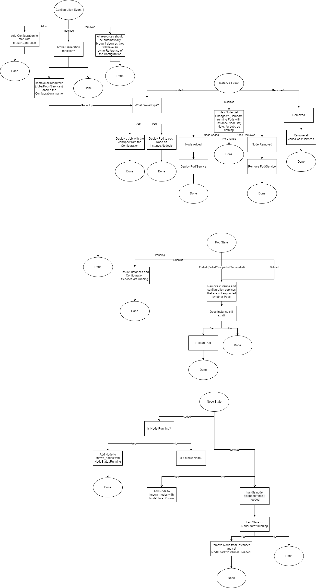

# Support for Deploying Terminating Pods as Brokers
This document discusses how to add support for deploying terminating Pods to use discovered IoT devices.

| | |
| --- | --- |
| Proposal Date | 11/29/2021 |
| Author | Kate Goldenring |


## Terms
| Term | Definition |
| --- | --- |
| `capacity`  | Maximum amount of containers that can use a device. Defines the number of usage slots a device's device plugin advertises to the kubelet |
| broker | The word Akri uses to describe the workload (currently only Pods) that the Akri Controller automatically deploys to use discovered IoT devices |
| Pod | The smallest deployable unit in Kubernetes |
| Jobs  | a [Job](https://kubernetes.io/docs/concepts/workloads/controllers/job/) is a higher level Kubernetesobject that creates one or more (by increasing `parallism` value) identical Pods and will retry until a set number of them successfully terminate. |

## Background
When Akri was first designed, one of the main use cases it was targeting was the easy creation of
protocol translation gateways. For example, Akri could be used to discover a USB camera and
automatically deploy a non-terminating Pod that would continuously advertise the camera as an
IP camera. The fact that these Pods act as middleware is why they were given the term "broker" in Akri. This
original design supports several use cases, such as protocol translation gateways, message brokers,
publishing data from devices, video streaming, and more. However, it does not support any use cases
where a short lived (or terminating) Pod should be deployed to use a device. These scenarios include
device management (modifying the settings of a device), firmware updates (ie performing an upgrade
on an IP camera), performing an action (such as taking a picture, reading the temperature, etc),
inventory (adding a device to a catalog after discovery by Akri), and more. These scenarios are
powerful and should be enabled in Akri by supporting the deployment of Pods that are allowed to
complete. In particular, support for specifying a single Kubernetes Job that should be deployed upon discovery
of each device should be enabled. 

This document proposes modification the Controller, Agent, Configuration CRD, and Instance CRD can
be redesigned to support terminating Pods.

## Akri's Current Deployment Strategy
Currently, Akri has only one deployment strategy: for each discovered device a broker Pod is
deployed to each node on the associated Instance's `nodes` list. If the device is no longer visible
(i.e. goes offline), then the Instance is deleted by the Agent and the broker is brought down by the
Controller. If the device reappears, the broker is re-scheduled. A user can specify how many nodes
can utilize a single device by setting the `capacity` value in a Configuration. A value of two means
at most two broker Pods will utilize the device at once. The broker is not allowed to ever
terminate. In this way, the Controller is creating a deployment of pods that is similar to a
[DaemonSet](https://kubernetes.io/docs/concepts/workloads/controllers/daemonset/), which requires
that the Pod `RestartPolicy` is `Always`.

> Note: every higher level resource (Deployment, DaemonSet, and ReplicaSet) requires a Pod
> `RestartPolicy` of `Always` except for Jobs and ChronJobs

## Simple Extension of Akri to Support Terminating Pods
Previously, Akri has only supported deploying non-terminating Kubernetes Pods as brokers. If a Pod
ever went down, the Controller would immediately re-deploy it. To support terminating Pods, Akri could simply modify this
automatic redeployment to be configurable. However, many of the scenarios mentioned in [the
Background](#Background) that use terminating Pods, would benefit from the enabling retries and parallelism. Implementing support for retries and parallelism in the Controller would be redundant work, as these fields are already built into [Kubernetes
Jobs](https://kubernetes.io/docs/concepts/workloads/controllers/job/). A
[Job](https://kubernetes.io/docs/concepts/workloads/controllers/job/) is a higher level Kubernetes
object that creates one or more (by increasing the `parallism` value) identical Pods and will retry
until a set number of them successfully terminate (`completions`) or a maximum number (`backoffLimit`) fail. The key
difference between Jobs and other managed Pod deployments (DaemonSets and Deployments) is that Jobs
are expected to complete, while the Kubernetes Scheduler will continue to redeploy Pods owned by
DaemonSets or Deployments. Previously, Akri has had a hands-on approach to deploying Pods. Using Jobs will offload scheduling decisions from the Akri Controller to the Kubernetes Scheduler for terminating Pods. Non-terminating Pods will Continue to be scheduled by the Controller.

To support both terminating and non-terminating Pods, changes will be made to the following parts of
Akri:
- The Configuration: The `brokerPod` section of the Configuration will be changed to a `brokerType`
  enum with a Pod or Job option a `brokerGeneration` field will be added to the Configuration to
  enable communicating when Jobs or Pods need to be redeployed.
- The Controller: Logic to deploy a Pod or Job depending on the `brokerType` of the Configuration.
- The Agent: Logic to not bring down a Configuration if the `brokerGeneration` changed.

## Add on to Support More Robust Scenarios with Terminating Pods
One of the main use cases for deploying Pods that terminate (or Jobs) to use IoT devices is device
management. In these scenarios, it may be useful to marshall information from the Broker to the
Instance about the status of the workload. Take the scenario of Akri being used to change the frame
rate of an IP camera. A Configuration would be deployed that uses the ONVIF discovery handler and
specifies a Job broker (using the new implementation described
[above](#Simple-Extension-of-Akri-to-Support-Terminating-Pods)) that would connect to the camera and
change its frame rate setting. It may be advantageous to have that broker then be able to report the
status of the update or pass any additional information into the Instance of the device it modified.
Rather than letting brokers directly modify Akri Instances, information could be transferred over
the file system. During allocate, the Agent can create a directory for the Instance (if it does not
already exist) and a sub-directory for the specific workload. Then, it would mount that subdirectory
in the Pod. The Agent would contain a file watcher on the appropriate directories. Each time a file
changed, it would propagate the contents into the Instance Custom Resource's `brokerInfo` map, a
proposed addition to the Instance. 

## Implementation
### Configuration CRD 
A Configuration initiates two actions: discovery and use of devices. Currently, the discovery part
of the Configuration sits in the `discoveryHandler` section; however, the use options are spread out
among the `brokerPodSpec`, `instanceServiceSpec` and `configurationServiceSpec`. Since adding Jobs
will break the Configuration CRD, it is a good opportunity to reorganize the Configuration and put
these use options one `deploymentStrategy` section. This also will help Akri transition to
supporting more deployment strategies in future designs.

> Note: Latest release version of the Configuration CRD can be viewed [here](https://github.com/project-akri/akri/blob/v0.7.0/deployment/helm/crds/akri-configuration-crd.yaml).

```
apiVersion: apiextensions.k8s.io/v1
kind: CustomResourceDefinition
metadata:
  name: configurations.akri.sh
spec:
  group: akri.sh
  versions:
    - name: v0
      served: true
      storage: true
      schema:
        openAPIV3Schema:
          type: object
          properties:
            spec:
              type: object
              properties:
                discoveryHandler: # {{DiscoveryHandlerInfo}}
                  type: object
                  properties:
                    name:
                      type: string
                    discoveryDetails:
                      type: string
               deploymentStrategy: # {{DeploymentStrategy}}
                  type: object 
                  properties:
                    brokerType: 
                      type: object # enum of deployment types
                      properties: 
                        brokerJobSpec: # {{JobSpec}}
                          x-kubernetes-preserve-unknown-fields: true
                          type: object
                          nullable: true
                        brokerPodSpec: # {{PodSpec}}
                          x-kubernetes-preserve-unknown-fields: true
                          type: object
                          nullable: true
                    brokerGeneration: # number
                      type: number
                    brokerProperties: # map<string, string>
                      additionalProperties:
                        type: string
                      type: object
                    instanceServiceSpec: # {{ServiceSpec}}
                      x-kubernetes-preserve-unknown-fields: true
                      type: object
                      nullable: true
                    configurationServiceSpec: # {{ServiceSpec}}
                      x-kubernetes-preserve-unknown-fields: true
                      type: object
                      nullable: true
               capacity:
                  type: integer
      additionalPrinterColumns:
      - name: Capacity
        type: string
        description: The capacity for each Instance discovered
        jsonPath: .spec.capacity
      - name: Age
        type: date
        jsonPath: .metadata.creationTimestamp
  scope: Namespaced
  names:
    plural: configurations
    singular: configuration
    kind: Configuration
    shortNames:
      - akric
```
Looking at each field of `deploymentStrategy`:
1. `brokerType`: optional declaration of an object Pod or Job that should be deployed. A maximum of
   one can be specified. If not specified, no deployments or services are made. This is the expanded
   version of `brokerPodSpec`.
1. `brokerGeneration`: version of the `brokerType`. An operator can increment the generation to
   signal that the deployment type has changed and all workloads should be brought down and new ones
   spun up. This enables a Configuration to be changed without removing all instances. This also
   makes it so another set of Jobs can be deployed.
1. `brokerProperties`: (unchanged but moved under `deploymentStrategy`) environment variables that
   will be set in all broker Pods/Jobs and displayed in the Instances of the Configuration. **Note:
   should this be renamed to reflect that these are a subset of an Instance's `brokerProperties`**
1. `instanceServiceSpec`: (unchanged but moved under `deploymentStrategy`) a service that is created
   for each broker of this Configuration. **Note may consider renaming since a broker can be using
   more than one instance now. Maybe `brokerServiceSpec`?**.
1. `configurationServiceSpec`: (unchanged but moved under `deploymentStrategy`) a service that is
   created for each broker of this Configuration.


> Note: This redesign brings up the question of whether the Configuration CRD should be split into two
separate CRDs a `DiscoveryConfiguration` and `UseConfiguration`. This may be something to consider
in the future as Akri supports more deployment strategies.

> Note: **Should this design move away from `broker` terminology and towards `workload` or another
term indicative of any workload deployed to discovered devices, whether it does management or
brokers information?**

### Instance CRD
The instance CRD needs one modification to support [adding broker status to a new `brokerInfo`
section of the Instance](#Add-on-to-Support-More-Robust-Scenarios-with-Terminating-Pods):
1. `brokerInfo`: After a Job completes, pertinent information can be propagated from the Job to the
   Agent (through the filesystem) to the Instance's `brokerInfo`. This may contain non-secret
   information such as current firmware version.

> Note: Latest release version of the Instance CRD can be viewed [here](https://github.com/project-akri/akri/blob/v0.7.0/deployment/helm/crds/akri-instance-crd.yaml).

```
apiVersion: apiextensions.k8s.io/v1
kind: CustomResourceDefinition
metadata:
  name: instances.akri.sh
spec:
  group: akri.sh
  versions:
    - name: v0
      served: true
      storage: true
      schema:
        openAPIV3Schema:
          type: object
          properties:
            spec:
              type: object
              properties:
                configurationName:
                  type: string
                brokerProperties:
                  additionalProperties:
                    type: string
                  type: object
                shared:
                  type: boolean
                nodes:
                  type: array
                  items:
                    type: string
                deviceUsage: # map<string, string>
                  additionalProperties:
                    type: string
                  type: object
                brokerInfo: # map<string, string>
                  additionalProperties:
                    type: string
                  type: object
      additionalPrinterColumns:
      - name: Config
        type: string
        description: The Configuration this Instance belongs to
        jsonPath: .spec.configurationName
      - name: Shared
        type: boolean
        description: Describes whether this Instance is shared
        jsonPath: .spec.shared
      - name: Nodes
        type: string
        description: Nodes that expose this Instance
        jsonPath: .spec.nodes
      - name: Age
        type: date
        jsonPath: .metadata.creationTimestamp
  scope: Namespaced
  names:
    plural: instances
    singular: instance
    kind: Instance
    shortNames:
    - akrii
```

### Agent Extension
The Agent will need to be extended to support propagating information from Jobs into the Instance.
#### File Watching for Jobs
Jobs run to termination and may be used in management scenarios with Akri. During execution or
before termination, a Job may wish to pass information to the instance about the status of the
update. This can be done through the file system. Specifically, the Agent will create a directory
for the Job within its `JOB_DIRECTORIES`. It will then mount this subdirectory into the Job. The
Agent will contain a file watcher that watches this directory for any updates. Any changes in file
contents will cause the contents to be (re)written to the `Instance.brokerInfo` map, where the key
will be the file name and the value will be the contents. This is where firmware update statuses
could be added, for example.

This file watcher should be able to be conditionally enabled.

> Note: More exploration is needed on how to handle new generations of
> `Configuration.brokerGeneration`. If subsequent Jobs are deployed to instances, should the
> `Instance.brokerInfo` section be cleared or just appended to?

### Controller Redesign
The Controller will need to be expanded to support the new deployment strategies. 
#### Current design
Currently, the Controller has Instance, Pod, and Node watchers. 
1. Instance Watcher: Creates Pods and Services as specified in the Configuration. Specifically, for
   added Instances, deploys a Pod and Service to each Node on the `Instance.NodeList`. If the
   Instance has changed, checks if a Node was added or removed and adds and removes the associated
   Pod and Services, respectively. If the Instance was removed, it removes all Pods and Services.
1. Pod Watcher: Ensures Instance and Configuration Services are running for Running Pods. Restarts
   Ended or Deleted Pods if their Instance still exists.
1. Node Watcher: Book keeps which Nodes are known and removes Nodes from Instances when they
   disappear.


#### New design
The new design of the Controller will have an additional Job Watcher and Configuration Watcher. It
will also add logic to the Instance watcher.
1. Instance Watcher: Extended to also create and delete Jobs (not just Pods).  Instance deletion
   events lead to the deletion of Pods/Jobs with that Instance label. 
1. Configuration Watcher: If `Configuration.brokerGeneration` has been updated, takes down and
   restarts all brokers to reflect the new workload.



## Implementation steps
This will support one (and possibly the only desired) Job scenario: deploying a Job to each
discovered Instance. No effort will be made to deploy a Job to each Node that can see a device. In
fact no Node selector will be specified. The Kubernetes Scheduler will choose one of the Nodes that
can see the Instance (it's Kubernetes resource).
1. Configuration CRD: For Jobs, the `brokerType` and `brokerGeneration` sections of the
   Configuration CRD are needed. To reduce the amount of breaking changes to the Configuration, this
   phase should include the addition of the `deploymentStrategy` section of the Configuration CRD
   and the movement of the related fields (`brokerProperties`, `instanceServiceSpec` and
   `configurationServiceSpec`) to be subfields.
1. Instance CRD: Make the desired Instance CRD changes to include the `brokerInfo` section.
1. Controller: Add a Configuration Watcher that watches for `brokerGeneration` changes and brings
   down and redeploys Jobs as needed. Potentially expand this to Pods, too. 
1. Controller: Add the Job Watcher to bring down Completed Jobs and free up the resources 
1. Agent: Add [file watcher and logic to populate `Instance.brokerInfo`](#File-Watching-for-Jobs)
   with file contents from brokers. 
1. Webhook: Update it to validate the new Configuration
1. Expand documentation [on requesting Akri
   resources](https://docs.akri.sh/user-guide/requesting-akri-resources).